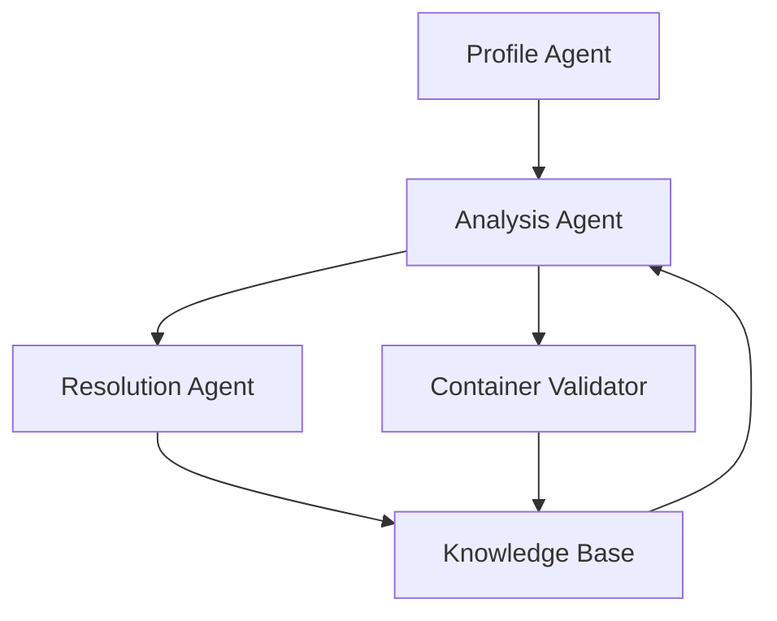

# Repo Doctor - Enhanced Specification v2.0

## Executive Summary

**Repo Doctor** is a CLI tool that diagnoses and resolves GitHub repository compatibility issues with local development environments, specifically targeting ML/AI repositories with complex GPU dependencies.

## Core Value Proposition

- **10-second compatibility verdict** for any public GitHub repo
- **Automated environment generation** (Docker, Conda, venv)
- **Learning system** that improves with each analysis
- **GPU-aware** compatibility checking for ML workloads
- **Cross-platform** support (Linux, WSL2)

## Architecture Overview

### Three-Agent System



### 1. Profile Agent
**Purpose**: Capture comprehensive system state

**Implementation**:
```python
class ProfileAgent:
    def profile(self) -> SystemProfile:
        return {
            "hardware": self._get_hardware_info(),
            "software": self._get_software_stack(),
            "containers": self._get_container_runtime(),
            "performance": self._get_compute_capabilities()
        }
```

**Key Features**:
- Hardware detection (GPU, CPU, RAM)
- Software stack (Python, CUDA, drivers)
- Container runtime availability (Docker, Podman)
- Compute capability scoring

### 2. Analysis Agent
**Purpose**: Deep repository analysis with multi-source validation

**Implementation Strategy**:
```python
class AnalysisAgent:
    async def analyze(self, repo_url: str) -> Analysis:
        # Parallel analysis
        results = await asyncio.gather(
            self._analyze_requirements(),
            self._analyze_code_imports(),
            self._check_dockerfiles(),
            self._scan_documentation(),
            self._check_ci_configs()
        )
        return self._consolidate_findings(results)
```

**Key Features**:
- Multi-file dependency extraction
- Import scanning via AST
- Docker/CI config analysis
- README pattern matching
- Model file detection (weights, checkpoints)

### 3. Resolution Agent
**Purpose**: Generate working solutions, not just recommendations

**Implementation Strategy**:
```python
class ResolutionAgent:
    def resolve(self, analysis: Analysis) -> Resolution:
        strategies = [
            DockerStrategy(),
            CondaStrategy(),
            VenvStrategy(),
            DevcontainerStrategy()
        ]
        
        for strategy in strategies:
            if strategy.can_handle(analysis):
                return strategy.generate_solution(analysis)
```

**Output Artifacts**:
- Dockerfile with multi-stage builds
- docker-compose.yml for complex setups
- environment.yml with exact pins
- .devcontainer/devcontainer.json
- setup.sh with validation steps

## Knowledge Base Design

### Structure
```
knowledge_base/
├── repos/
│   └── {org}/{repo}/
│       ├── analyses/
│       │   └── {commit_hash}.json
│       ├── solutions/
│       │   ├── successful/
│       │   └── failed/
│       └── patterns.yaml
├── compatibility/
│   ├── cuda_matrix.json
│   ├── pytorch_matrix.json
│   └── tensorflow_matrix.json
└── patterns/
    ├── common_failures.yaml
    └── proven_fixes.yaml
```

### Learning Mechanism
```python
class KnowledgeBase:
    def record_outcome(self, analysis, solution, outcome):
        if outcome.success:
            self._update_success_patterns(solution)
        else:
            self._analyze_failure(outcome.logs)
            self._suggest_alternative()
```

## CLI Interface Design

### Primary Commands
```bash
# Basic usage
repo-doctor check <repo_url>

# Advanced usage
repo-doctor check <repo_url> \
    --strategy docker \
    --validate \
    --gpu-mode strict \
    --output ./environments/

# Knowledge base operations
repo-doctor learn --from-ci <repo_url>
repo-doctor patterns --show-failures
repo-doctor cache --clear
```

### Output Format
```
🔍 Analyzing CompVis/stable-diffusion...

System Profile:
  ✓ GPU: RTX 4090 (24GB)
  ✓ CUDA: 12.1
  ✓ Python: 3.10.12

Compatibility Check:
  ⚠ PyTorch version requires CUDA 11.8
  ✓ All Python dependencies available
  ✓ Sufficient VRAM for default model

Resolution:
  → Generated: Dockerfile (CUDA 11.8 base)
  → Generated: environment.yml
  → Validation: Starting container test...
  
  ✅ Container test successful!
  
Quick Start:
  docker build -t stable-diffusion .
  docker run --gpus all -p 7860:7860 stable-diffusion
```

## Implementation Roadmap

### Phase 1: Core Functionality (Week 1-2)
1. Profile Agent with GPU detection
2. Basic requirement parsing
3. Simple Docker generation
4. CLI skeleton with Click

### Phase 2: Intelligence Layer (Week 3-4)
1. Compatibility matrix integration
2. Knowledge base CRUD operations
3. Pattern matching for common issues
4. Container validation

### Phase 3: Advanced Features (Week 5-6)
1. Multi-strategy resolution
2. Async analysis pipeline
3. CI/CD config parsing
4. Web-based compatibility checks (optional)

### Phase 4: Agent Enhancement (Week 7-8)
1. LLM integration for complex cases
2. Auto-fixing with iterations
3. Performance benchmarking
4. Collaborative knowledge sharing

## Technical Stack

### Core Dependencies
```yaml
runtime:
  - python: ">=3.9"
  - click: "^8.0"  # CLI framework
  - pydantic: "^2.0"  # Data validation
  - aiohttp: "^3.9"  # Async HTTP
  - docker: "^7.0"  # Container operations
  - rich: "^13.0"  # Terminal UI

analysis:
  - ast: "builtin"  # Code parsing
  - pygithub: "^2.0"  # GitHub API
  - pypi-simple: "^1.0"  # Package registry
  - conda-api: "^1.0"  # Conda registry

agents:
  - langchain: "^0.1"  # Agent framework
  - openai: "^1.0"  # LLM integration (optional)
  - chromadb: "^0.4"  # Vector store for patterns
```

## Key Differentiators

1. **GPU-First Design**: Unlike generic dependency checkers, deeply understands CUDA/GPU requirements
2. **Validation by Default**: Actually tests solutions in containers
3. **Incremental Learning**: Gets smarter with each repo analyzed
4. **Multi-Strategy**: Doesn't force Docker if Conda works better
5. **Offline-First**: Works without internet for known repos

## Success Metrics

- **Speed**: <10 seconds for basic compatibility check
- **Accuracy**: >90% successful environment generation
- **Coverage**: Support top 100 ML repos out of the box
- **Learning**: 50% reduction in resolution time for similar repos

## Configuration File

```yaml
# ~/.repo-doctor/config.yaml
defaults:
  strategy: auto  # docker|conda|venv|auto
  validation: true
  gpu_mode: flexible  # strict|flexible|cpu_fallback
  
knowledge_base:
  location: ~/.repo-doctor/kb/
  sync: false  # Enable cloud sync
  
advanced:
  parallel_analysis: true
  cache_ttl: 604800  # 7 days
  container_timeout: 300  # 5 minutes
  
integrations:
  openai_api_key: ${OPENAI_API_KEY}
  perplexity_api_key: ${PERPLEXITY_API_KEY}
  use_llm_fallback: false
```

## Error Handling Philosophy

1. **Fail gracefully**: Always provide partial solutions
2. **Explain failures**: Clear, actionable error messages
3. **Suggest alternatives**: If Docker fails, try Conda
4. **Learn from failures**: Add to knowledge base

## Future Enhancements

### Near-term (3 months)
- VS Code extension
- GitHub Action for CI/CD
- Public knowledge base API
- Benchmark suite integration

### Long-term (6+ months)
- Multi-language support (Rust, Julia)
- Cloud environment provisioning
- Cost estimation for cloud GPU
- Collaborative filtering for solutions

## Example: Complete User Journey

```bash
$ repo-doctor check https://github.com/huggingface/diffusers

🔍 Profiling system...
📦 Analyzing repository...
🧬 Checking compatibility...

⚠️ Compatibility Issues Found:
  1. CUDA version mismatch (need 11.8, have 12.1)
  2. Missing accelerate package

💡 Generating solutions...

✅ Solution Ready:
  - Docker environment (recommended)
  - Conda environment (alternative)

Would you like to validate the Docker solution? [Y/n]: y

🐳 Building container...
🧪 Running validation tests...
✅ All tests passed!

📁 Files created:
  - ./Dockerfile
  - ./docker-compose.yml
  - ./SETUP_INSTRUCTIONS.md

Start with: docker-compose up

💾 Saving to knowledge base for future use...
Done! This analysis will speed up similar repos.
```

## Design Principles

1. **Speed over perfection**: Fast feedback loop
2. **Practical over theoretical**: Test everything
3. **Specific over generic**: ML/AI focus
4. **Learning over static**: Improve with use
5. **Helpful over minimal**: Rich feedback

## Testing Strategy

### Unit Tests
- Mock system profiles
- Synthetic repo structures
- Compatibility matrix validation

### Integration Tests
- Real GitHub repos (top 20 ML)
- Container build verification
- Cross-platform validation

### End-to-End Tests
- Complete user journeys
- Failure recovery paths
- Knowledge base persistence

### Potential Pitfalls to Avoid
- Over-relying on LLMs - Use them for edge cases, not core logic
- Ignoring Windows users - WSL2 support is crucial for broader adoption
- Not handling private repos - Consider GitHub token support early
- Assuming Docker availability - Have fallbacks for systems without container runtime
- Perfectionism - Ship v1 that solves 80% of cases well